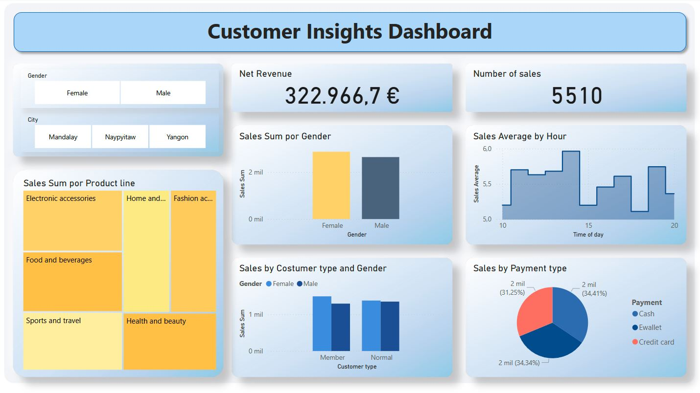

# BI
Repository where I store my projects created with Power BI.

## SuperMarketAnalytics

In the first instance, this dashboard applies customer analytics using the **[Supermarket Sales](https://www.kaggle.com/datasets/aungpyaeap/supermarket-sales)** dataset, obtaining information on purchase categories, payment methods, revenue, and sales per hour, filtered by gender and city.

